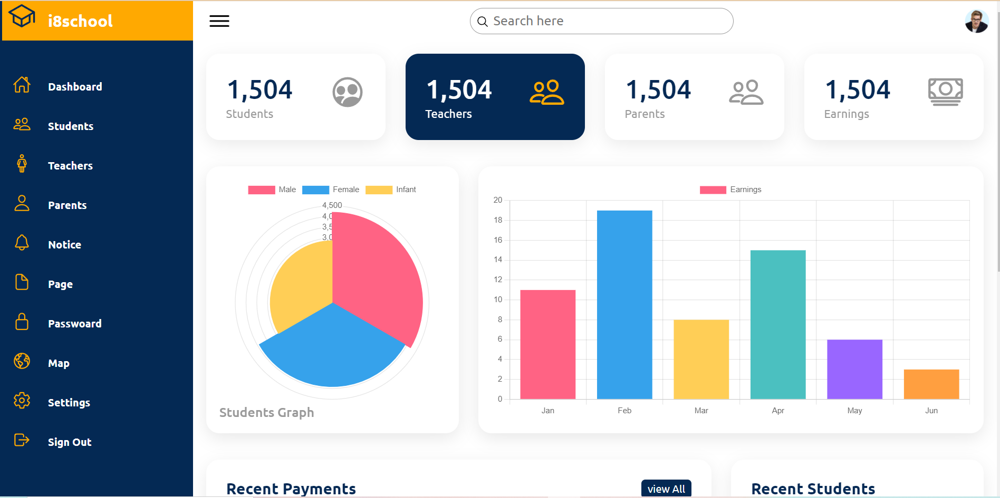
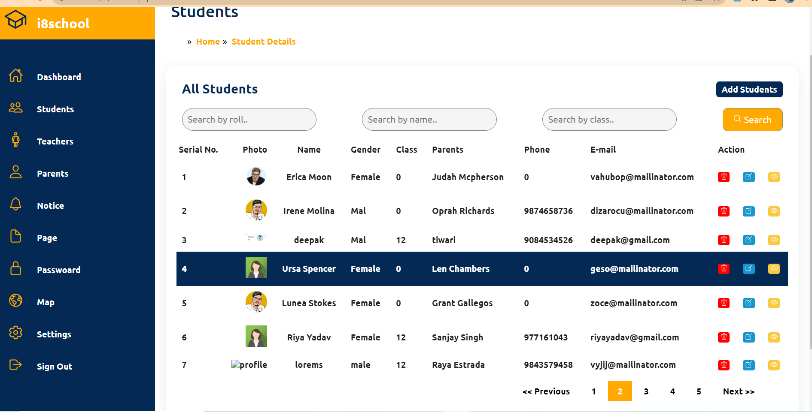
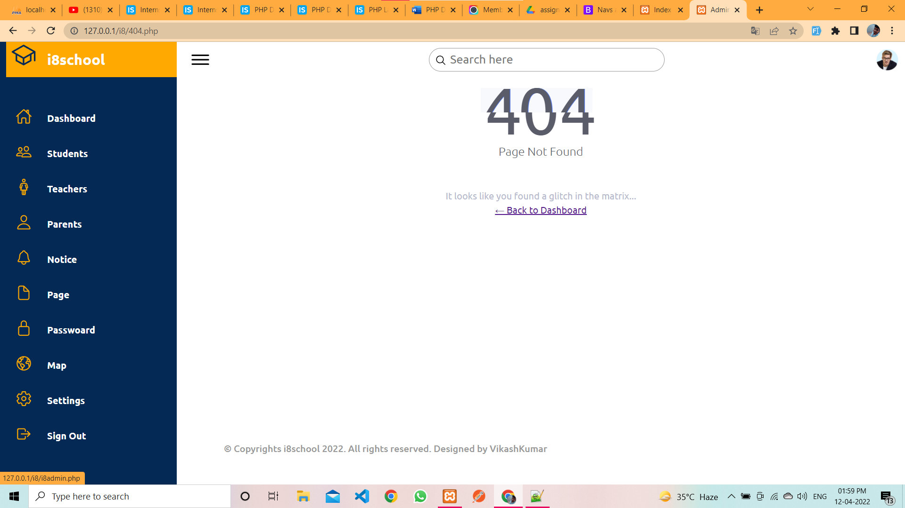
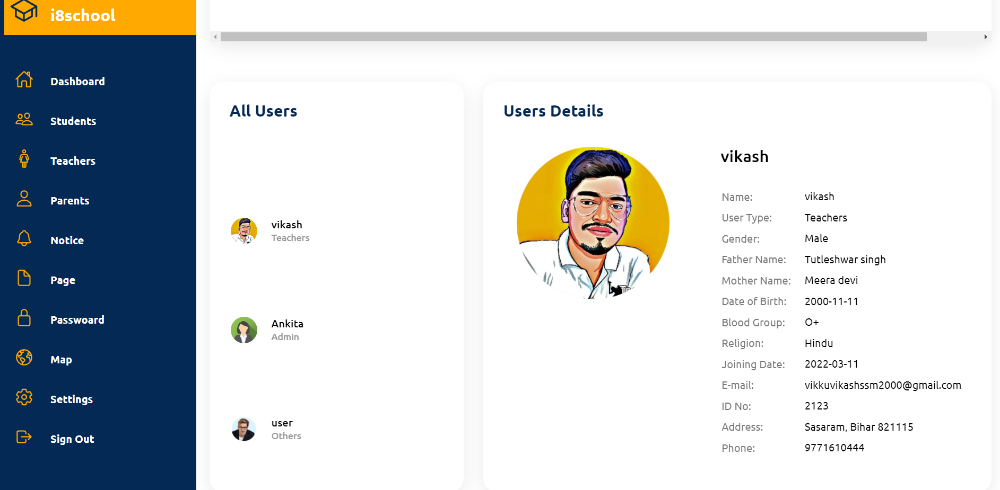

# Students_management

Student management system using PHP and MySQL is a web-based application. Student Management Project is software that is helpful for students as well as the school authorities.

## Demo

[i8school](https://i8school.epizy.com/i8/i8school.html)

## Features

- Login/Signup
- Notice board
- Map
- Live previews
- Fullscreen mode
- Cross platform (Responsive)

## Lessons Learned

What did you learn while building this project? What challenges did you face and how did you overcome them?

## Screenshots
### Dashboard

### Student

### Notice

### page

### setting

## 🚀 About Me
I'm a full stack developer...

## 🛠 Skills
Javascript, HTML, CSS, **PHP,** **MYSQL...**

## Support

For support, email vikashkumar977161@gmail.com.

:pray: If you like this project plz give :star2: Star 

